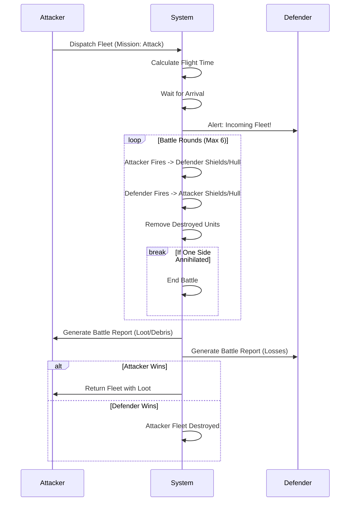

# Combat System

The combat system in universe-empire-domions is a round-based simulation where fleets clash for supremacy.

## ⚔️ Battle Mechanics

Battles are resolved in **6 rounds**. If no side is destroyed after 6 rounds, the battle ends in a draw, and the attacker retreats.

### Combat Formula
Each unit has three core stats:
1.  **Structure (Hull)**: The hit points of the ship. If this reaches 0, the ship is destroyed.
2.  **Shield**: Regenerates fully every round. Absorbs damage before it hits the Hull.
3.  **Attack**: The raw damage output per round.

### Rapid Fire
Certain ships have "Rapid Fire" against other ship types, allowing them to fire multiple times per round if they hit a specific target.

## 🕵️ Espionage

Espionage is the art of gathering intel before an attack.

*   **Espionage Probes**: Sent to gather data.
*   **Counter-Espionage**: The chance that the defender detects and destroys the probes. This is calculated based on the number of probes sent and the difference in **Espionage Technology** levels.
*   **Intel Levels**:
    *   *Level 1*: Resources only.
    *   *Level 2*: Resources + Fleet.
    *   *Level 3*: Resources + Fleet + Defense.
    *   *Level 4+*: Full detailed report including Tech levels.

## 💣 Sabotage

Specialized missions to disrupt enemy infrastructure.

*   **Targets**: Mines, Power Plants, Shipyards.
*   **Risk**: High chance of failure and loss of agents.
*   **Outcome**: Can temporarily disable buildings or reduce production efficiency.

## 📜 Battle Reports

After every engagement, a detailed report is generated containing:
*   **Rounds Fought**: Duration of the battle.
*   **Losses**: Total unit losses for both sides.
*   **Debris Field**: Wreckage created (Metal/Crystal) that can be harvested by Recyclers.
*   **Loot**: Resources plundered (up to 50% of defender's storage).

## UML: Combat Flow

