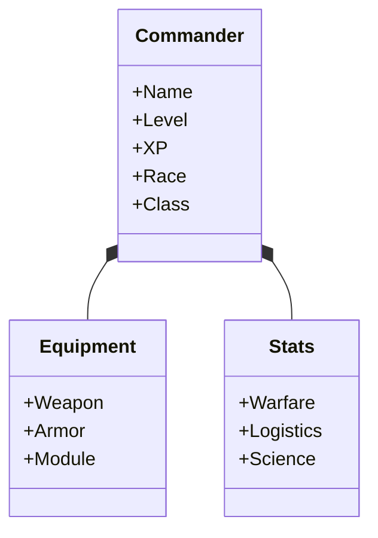

# Commander System

The RPG layer of universe-empire-domions. You are not just an abstract entity; you are the Commander.

## 🧬 Races
Your biological origin affects your empire's traits.
*   **Terran**: Balanced. No major strengths or weaknesses.
*   **Lithoid**: Eat minerals. +10% Metal production, Slower pop growth.
*   **Synthetics**: +10% Research, require Energy instead of food.

## 🎓 Classes
Your specialization.
*   **Admiral**: Fleet buffs (+Combat Speed, +Firepower).
*   **Industrialist**: Economy buffs (+Mine Output, +Build Speed).
*   **Scientist**: Research buffs (+Tech Speed, +Discovery Chance).

## 📈 Progression
*   **Leveling**: Gain XP from building, researching, and combat.
*   **Stats**:
    *   *Warfare*: Fleet damage.
    *   *Logistics*: Resource output.
    *   *Science*: Research speed.
    *   *Engineering*: Build speed.
*   **Equipment**: Equip items found in expeditions or bought on the market to boost stats (e.g., "Plasma Rifle", "Neural Interface").

## UML: Character

