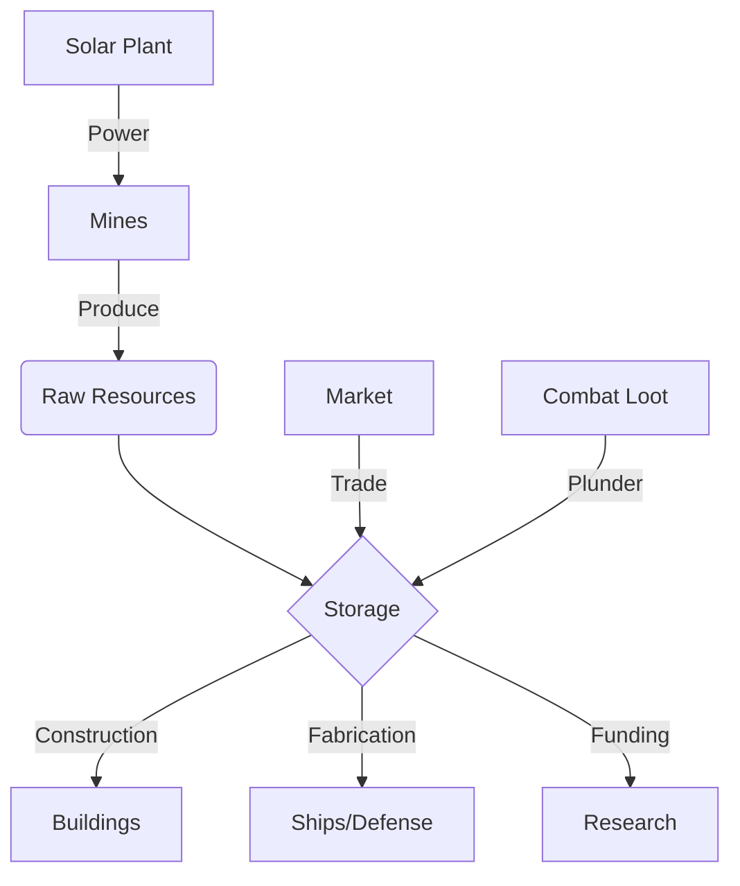

# Economy & Resources

The backbone of any stellar empire is its economy. universe-empire-domions uses a four-resource system.

## 💎 Core Resources

### 1. Metal
*   **Usage**: Basic structure construction, ship hulls, armor.
*   **Production**: Metal Mine.
*   **Abundance**: High.

### 2. Crystal
*   **Usage**: Electronics, research, energy weapons, shields.
*   **Production**: Crystal Mine.
*   **Abundance**: Medium.

### 3. Deuterium
*   **Usage**: Fuel for ships, research, fusion reactors.
*   **Production**: Deuterium Synthesizer.
*   **Abundance**: Low (Hard to refine).

### 4. Energy
*   **Usage**: Powers mines and synthesizers.
*   **Production**: Solar Plant, Fusion Reactor, Solar Satellites.
*   **Mechanic**: If Energy is negative, production of all other resources drops efficiency.

## 🏭 Production Logic

Production per hour is calculated using the formula:
`Base Production * Level Factor * Speed Factor * Energy Factor`

*   **Energy Factor**: `min(1, Current Energy / Required Energy)`
*   **Commander Bonus**: Industrialist class gets +15% production.
*   **Geologist**: Officer who boosts mine output by 10%.

## ⛏️ Automated Mining (Cron Jobs)

The game simulates a living economy even when the player is idle via Cron Jobs.
*   **Auto-Mine**: If `Positronic AI` tech is researched, automated drones will periodically collect resources from the local system.
*   **Market Refresh**: Vendor inventories rotate every 24 hours.

## UML: Resource Loop

