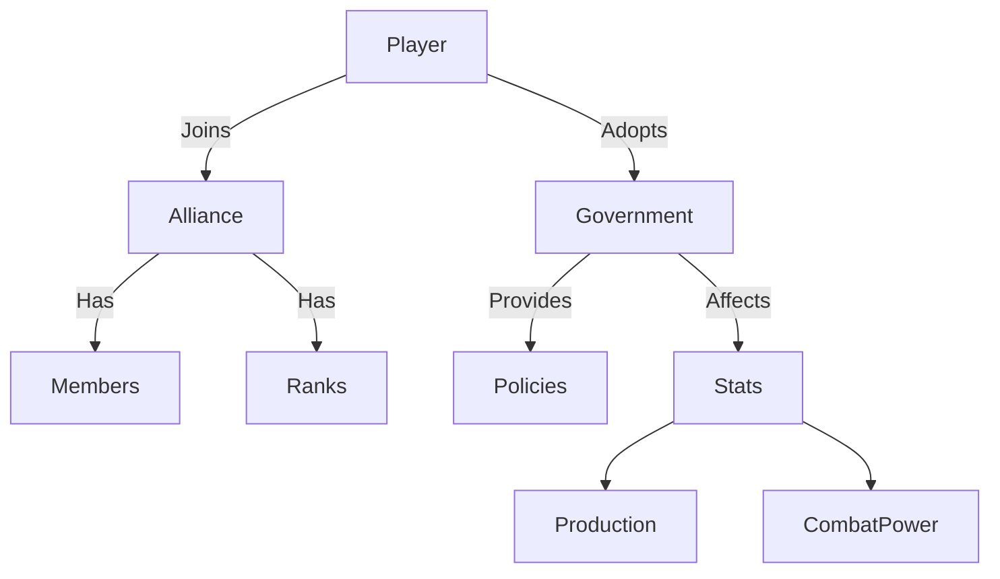

# Social & Politics

universe-empire-domions is not just about ships; it's about civilization.

## 🤝 Alliance System
Players can band together to form Alliances.
*   **Features**:
    *   Alliance Tag and Name.
    *   Internal Member List with Ranks (Leader, Recruit).
    *   Shared Chat/Message Board.
    *   (Planned) Joint Attacks / ACS (Alliance Combat System).

## 🏛️ Government Types
Your empire's government affects your passive bonuses.

### 1. Military Junta
*   **Bonus**: +10% Ship Build Speed, +5% Damage.
*   **Malus**: -10% Science output.

### 2. Technocracy
*   **Bonus**: +10% Research Speed.
*   **Malus**: -10% Stability.

### 3. Trade Federation
*   **Bonus**: +10% Trade Income, Cheaper Market Prices.
*   **Malus**: Weaker Ground Troops.

### 4. Democracy
*   **Bonus**: +10% Happiness/Stability, Higher Production.
*   **Malus**: Slower decision making (Building time).

## ⚖️ Stability & Policies
*   **Stability**: Affects resource production efficiency.
*   **Policies**: Toggleable laws (e.g., "Wartime Economy", "Open Borders") that provide trade-offs.

## UML: Social Structure

